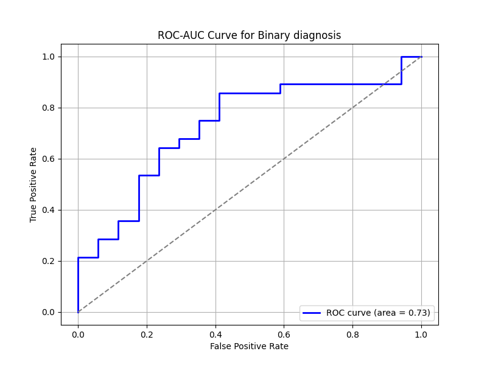
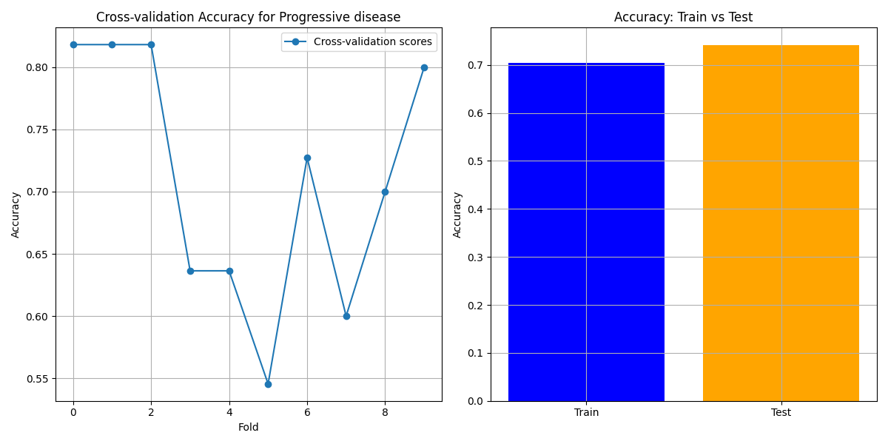

### README: **FibroPred Predictive System**

---

#### **Description**
FibroPred is a predictive system designed to analyze clinical data and provide predictions for specific medical outcomes related to fibrosis. The tool employs machine learning models, primarily Random Forest classifiers, to forecast the likelihood of various events or conditions, such as mortality, necessity for transplantation, and progressive disease.

The system provides an easy-to-use interface built with Gradio, allowing users to input feature values and obtain predictions. Models and their configurations are stored and loaded dynamically, ensuring modularity and adaptability.

---

#### **Features**
1. **Prediction Targets**:
   - **Death**: Likelihood of patient mortality based on clinical and diagnostic features.
   - **Binary Diagnosis**: Classification of patients into specific diagnostic categories.
   - **Necessity of Transplantation**: Assessment of whether a patient is likely to need a transplant.
   - **Progressive Disease**: Prediction of disease progression based on longitudinal data.

2. **Dynamic Model Loading**: Models and feature sets are loaded dynamically from a pre-configured directory (`models`).

3. **Gradio Interface**: A tabbed interface for each prediction target, where users can input values interactively and receive predictions in real-time.

---

#### **Predictive Features**
Below are the features used for prediction across all targets:

1. **Pedigree**: Represents the familial history related to fibrotic conditions.

2. **Age at diagnosis**: Age of the patient at the time of diagnosis.

3. **FVC (L) at diagnosis**: Forced vital capacity in liters at the time of diagnosis, reflecting lung function.

4. **FVC (%) at diagnosis**: Forced vital capacity as a percentage of the expected value for the patient’s age and sex.

5. **DLCO (%) at diagnosis**: Diffusion capacity for carbon monoxide as a percentage, measuring gas exchange efficiency in the lungs.

6. **RadioWorsening2y**: Radiological assessment of lung deterioration over two years.

7. **Severity of telomere shortening - Transform 4**: Indicates the degree of telomere shortening.

8. **Progressive disease**: Binary variable indicating whether the disease is progressive or stable.

9. **Biopsy**: Binary variable indicating whether a biopsy was performed.

10. **Genetic mutation studied in patient**: Binary variable indicating the presence of specific genetic mutations.

11. **Comorbidities**: Binary variable representing the presence of relevant comorbidities.

12. **Tobacco use**: Binary variable reflecting whether the patient has a history of tobacco use.

---

#### **Setup Instructions**
1. Clone or download the repository.
2. Ensure Python 3.8+ is installed.
3. Install dependencies using the command:
   ```bash
   pip install -r requirements.txt
   ```
4. Place trained models in the `models` directory. Models should be `.pkl` files containing:
   - `model`: Trained Random Forest model.
   - `features`: Feature list used during model training.

---

#### **Usage**
1. Run the application:
   ```bash
   python app.py
   ```
2. Access the Gradio interface through the displayed local or public URL.
3. Select a prediction tab, input feature values, and click "Submit" to get predictions.

---

#### **Key Scripts**
1. **app.py**:
   - Implements the Gradio interface.
   - Maps user-friendly model names to actual models and their features.

2. **fibropred_model.py**:
   - Contains the preprocessing pipeline, including imputation and feature selection.
   - Includes functions for training, evaluation, and visualization.

3. **model_utils.py**:
   - Functions to load models and their features dynamically.
   - Handles predictions using preloaded models.

4. **requirements.txt**:
   - Lists the Python dependencies required for the system.

---

#### **Technical Highlights**
- **Machine Learning Framework**: Models are built using `scikit-learn`, leveraging Random Forest classifiers for robust predictions.
- **Visualization**: The script includes utilities for plotting feature importance, ROC-AUC curves, and overfitting diagnostics.
- **Dynamic Handling**: Feature lists and models are dynamically linked, ensuring flexibility when adding new prediction targets.

---

#### **Results**

The performance and feature importance for the prediction targets are detailed below:

##### **Prediction Target: Death**


- **Cross-validation Accuracy**:
  The cross-validation results for "Death" show some variability across folds, but overall, the model achieves consistently high accuracy.

- **Train vs Test Accuracy**:
  


- **Feature Importance**:
  Features such as "Progressive disease", "DLCO (%) at diagnosis", and "FVC (%) at diagnosis" are the most influential.


- **ROC-AUC Curve**:
  The ROC-AUC curve illustrates strong model performance, with an AUC of 0.92.

##### **Prediction Target: Binary Diagnosis**


- **Cross-validation Accuracy**:
  Variability in cross-validation accuracy is observed, but the model maintains high performance across most folds.




- **Feature Importance**:
  Key predictors include "Age at diagnosis", "Pedigree", and "Tobacco use".


- **ROC-AUC Curve**:
  The high AUC value of 0.95 indicates excellent discrimination ability.

##### **Prediction Target: Progressive Disease**


- **Cross-validation Accuracy**:
  Accuracy scores across folds highlight variability, but peaks show strong model performance.

- **Train vs Test Accuracy**:
  


- **Feature Importance**:
  "DLCO (%) at diagnosis", "Age at diagnosis", and "Pedigree" emerge as the dominant predictors.


- **ROC-AUC Curve**:
  With an AUC of 0.98, the model demonstrates exceptional predictive power.

##### **Prediction Target: Necessity of Transplantation**


- **Cross-validation Accuracy**:
  Cross-validation reveals excellent model accuracy.


- **Feature Importance**:
  "RadioWorsening2y", "FVC (%) 1 year after diagnosis", and "Comorbidities" are critical.


- **ROC-AUC Curve**:
  The model achieves an AUC of 1.00.

---

#### **Future Improvements**

- **Optimizing Variable Names**:
  Review and refine variable naming conventions for clarity.

- **Improving Model Precision**:
  Retrain the model with a larger dataset.

- **Identifying Optimal Medical Variables**:
  Simplify the model by removing less relevant variables.

- **Testing Model Performance with Reduced Variables**:
  Assess predictive performance with a reduced set of variables.

- **Expanding Dataset Diversity**:
  Incorporate data from diverse demographics.

- **Adding Longitudinal Data Analysis**:
  Integrate temporal patterns in disease progression.

- **Real-time Model Retraining**:
  Develop mechanisms for real-time updates.

### Associated Space

Check out the interactive demo of this model on Hugging Face Spaces:  
[](https://huggingface.co/spaces/amonfortc/FibroPred)


---

This README provides a comprehensive guide to understanding and using the **FibroPred** predictive system effectively.

